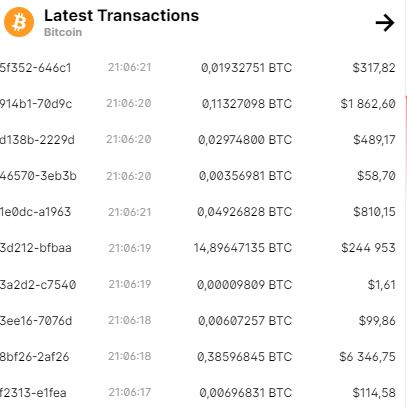
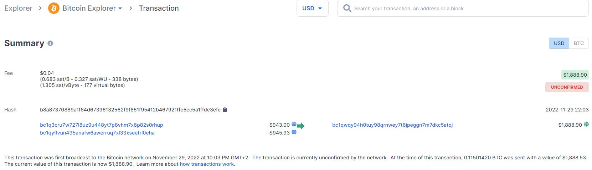

# ICT4HM103-3004
School course repo: ICT Security Basics from Trust to Blockchain

***
## Homework 5[^tero]
***

### Felten et al 2015: Bitcoin and Cryptocurrency Technologies, videos Week 2

#### Centralization vs. Decentralization[^coursera]

Decentralization is one of the key factors when it comes to cryptocurrency. This is achieved by technical and incentive engineering.

Decentralization is not all-or-nothing: ie. Emails use a decentralized (SMTP) protocol but are dominated by centralized webmail services.

Decentralization questions regarding BTC:
1. Who maintains the ledger?
2. Who has authority over which transactions are valid?
3. Who creates new bitcoins?
4. Who determines how the rules of the system change?
5. How do BTCs acquire exchange value?

- P2P network
 - open to anyone and easy to access
 - anybody can run a BTC node, download the client etc.
- Mining
 - open to anyone, but concentration of power is possible
 - reqs a lot of money to start (CPU, GPU etc.)
- Updates to software
 - developers have a lot of power

#### Distributed consensus[^coursera]

Distributed consensus is a key technical challenge of decentralized electronic cash.

> Example of a google search: There is a lot of servers working on the backend recording all of the user inputs likea searches and comments. All of the recording servers / nodes need to be consistent: either all of them record the inputs of the user or none of them. If only some of them save the input into the databases then you end up with a inconsistent database record.

Distributed key-value store enables alredy in-use applications such as DNS (domain name system), public key directory, stock trades.

**Theres a fixed # of nodes / processes and each of these has some input value. Then consensus protocol happens meaning that the protocol terminates and alld correct nodes decide on the same value and that value must be proposd by some correct node. Some of the node migth be faulty =/= correct node.**

When I pay money to my friend in BTC, I will broadcast the transaction to all the BTC nodes. 
The block is signed by me and it includes my friend's public key and a hash pointer. And this is broadcast to every node. My friend does not need to have a node on the network, the BTC will be their's regardless.

When these transactions occur in the network, there needs to be a consensus on what transactions occur and in which order
- All nodes have a sequence of blocks of transactions that they've reached consensus on
- Each node has a set of outstanding transactions that has been broadcast to it

#### Consensus without identity: the Block Chain[^coursera]

in this section it is explained basically how the blockchain system works in a P2P network and what are the security dimensions in it. This section is basically revision in a more technical level of previous week's lecture.

BTC nodes do not have identities because identity is hard in a P2P system and pseudonmity is a goal of BTC. There is no central identifier in P2P system. 

In a simplified consensus algorithm new transactions are broadcast to everyone. New transavtions are collected into a block and each round a random node gets to broadcast its block. When that happens other nodes will accept it, assuming all transactions in it are valid (no double spending!) and as a sign of acceptance nodes will include the accepted block's hash in the next block they create.

Confirmation process is a key factor in blockchain security. For example double-spend probability decreases exponentially with number of confirmations. Nodes will as a rule (honest ones at leas) extend the longest valid branch.

#### Incentives and Proof of Work

When money is involved, can we give nodes incentives for behaving honestly? Or can we penalize dishonest nodes?

Incentive examples: block reward, only received if you are in the long-term consensus branch
1. creator of block gets to include special coin-creation transaction in the block and choose recipient address of the transaction
 - currently 25BTC
2. Creator of transaction can choose to make output less than input value -> remainder goes to block creator

Remaining issues are how do you prevent Sybil attacks (invalid nodes to the network), pick random node or avoid free-for-all due to incentives and rewards?

Instead of randomly picking a node we select a node in proportion to a resource that should not be mopolized:
- in proportion to computing power: proof-of-work
- in proportion to ownership: proof-of-stake

This can be achieved using a nonce  that is included in the blockchain amlong previous block's hash and transactions. So mining means that you are trying to repeatedly solve this nonce and then you get block. The difficulty is changing according to the mining ecosystem around the globe -> more miners the harder the targets can be.

#### Detective Coinbit[^bitquery],[^bitstamp]

Blockchain will keep the record of every transaction ever to have happened in the network. And the are available for everyone to see. You have to know which currency is used in the transaction in order to get insight into that spesific transaction.

The transactions contain transaction data, the amount of currency transferres, the sender's address, the receiver's address and timestamp. All the transactions receive an id which is a has of all the transaction data.

As an example here is a pretty hefty transaction for viewing pleasure: https://www.blockchain.com/btc/tx/671b368ba310d7dca7308f8e31b12fd4ad9b0bae699e3ed13792d49cec5269f1 

#### Dashboard of Doom[^dashboard]

As stated by Mikko Hirvelä in the previous week's lecture there are many factors currently making cryptocurrency mining not-so-profitable at the moment:
- Price of good grpahics card that are needed for mining
 - Good GPU with a high hash rate of ~170MH costs around 850€ in Finland
- Price of electricity
 - A good mining rig will use a lot of energy an in Mikko's case 12 GPUs consume almost 1000W
- Price of different minable coins are not very good at the moment
 - Considering the electirc costs, cost of good GPUs etc. the profits are very low and the profits are based on a long-term expectations rather than get-rich-quick expectations.

 My personal estimate of mining now and in the future:
 Mining is a good although a really expensive hobby. You can obviously learn a lot about not only blockchains and hash rates. but also about building stuff with your own hands, estimating the risk-reward and estimating the profits in a long term. I think that there is always a chance that cryptocurrencies will make a comeback and everything you spend now on mining may come back in the future. But there are constantly so many news and articles and talk about how cryptocurrencies are not very good for the environment or how they seem like tech-bro jargon that it may take a long time. Or it may take a different approach entirely to the blockchain technology.

[^tero]: https://terokarvinen.com/2022/trust-to-blockchain-2022-autumn/
[^coursera]: https://www.coursera.org/learn/cryptocurrency/lecture/At1IC/distributed-consensus
[^bitquery]: https://bitquery.io/blog/bitcoin-analysis
[^bitstamp]: https://www.bitstamp.net/learn/blockchain/where-to-track-cryptocurrency-transactions/
[^dashboard]: https://mikohirvela.fi/cryptomonitoring